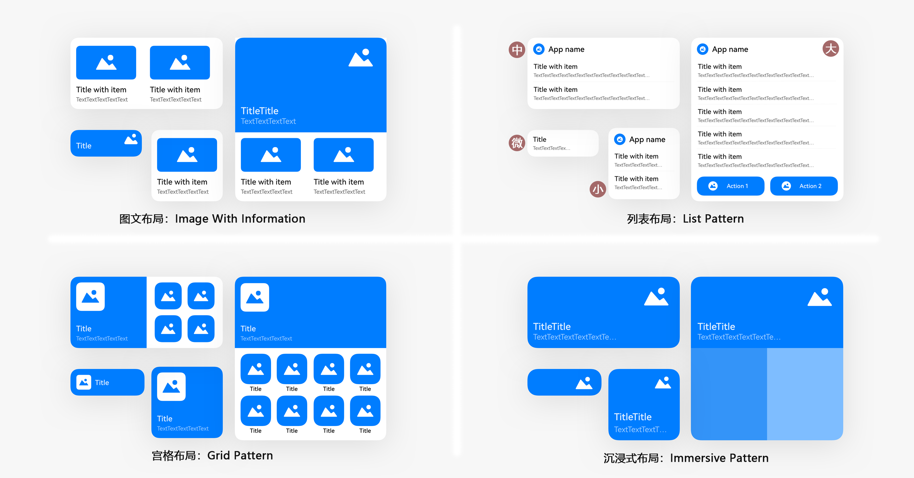
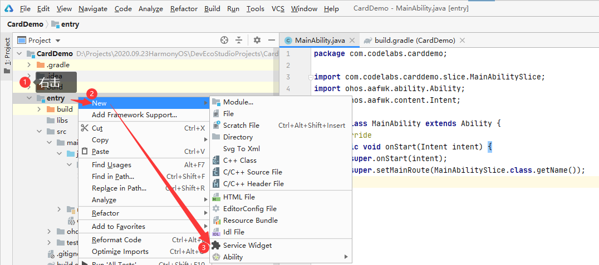
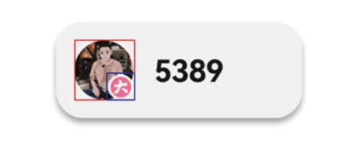
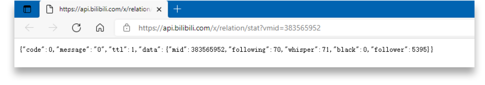
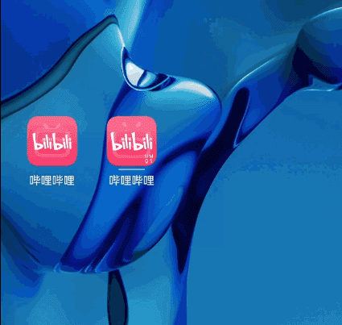
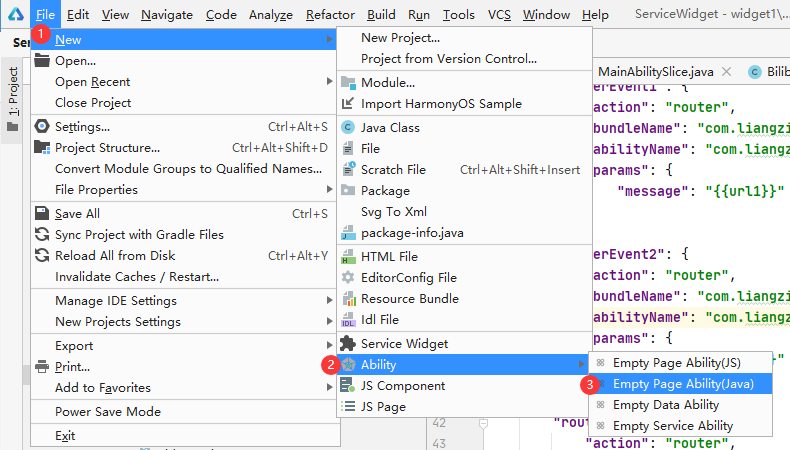
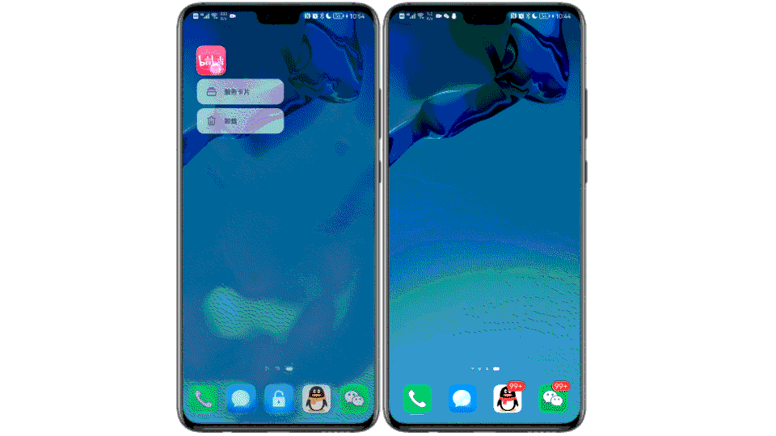
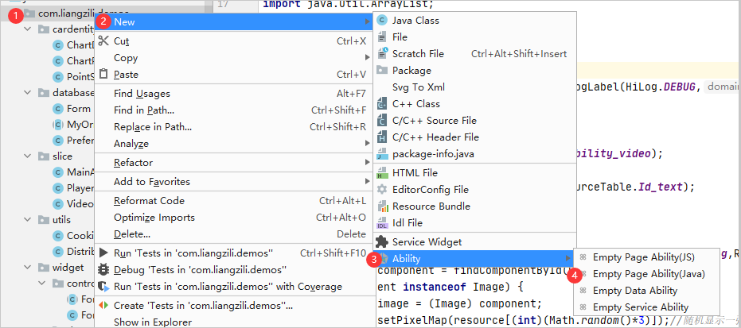

# BilibiliCards

[#HarmonyOS征文#+完整服务卡片项目开发，为Bilibili添加服务卡片。](https://developer.huawei.com/consumer/cn/forum/topic/0201631483935060392?fid=0101587866109860105)

[项目预览视频播放地址](https://www.bilibili.com/video/BV1cv411K7Pu/)

<iframe width="960" height="540" src="//player.bilibili.com/player.html?aid=249580798&bvid=BV1cv411K7Pu&cid=380159498&page=1" frameborder="0" allowfullscreen>

## 介绍
这是一款纯鸿蒙版的哔哩哔哩服务卡片应用。

6月2日鸿蒙发布，今年的六月已经被鸿蒙刷屏了。从安卓到鸿蒙，最直观的变化应该就是服务卡片了。我也是在学习鸿蒙的同时，实际体验一下服务卡片的开发。
给大家看看最终的效果。

|  |  |  |
| ---------------------------------------------------- | ---------------------------------------------------- | ---------------------------------------------------- |
|                                                      |                                                      |                                                      |

接下来分享下我的制作过程，我使用的开发环境是
IDE：DevEco Studio 2.1 Release
SDK：API Version 5

软件安装和项目建立的部分就跳过了，相信大家都比较熟悉了。直奔主题服务卡片的制作。


# 一、服务卡片设计

首先要先了解服务卡片，都有哪些尺寸，支持哪些组件，使用什么语言。然后规划好要实现哪些功能。

## 1.尺寸规格

服务卡片有4种尺寸，分别是微卡片、小卡片、中卡片、大卡片。官方提供了4种基础模板，12种高级模板。可以选择。基础模板如下图


## 2.功能设计

服务卡片设计的初衷就是**信息显示、服务直达**。依照这个原则，我找了几个Bilibili中我比较常用的功能，来制作服务卡片，比如追番列表。


## 3.开发语言

看下表就一目了然了，就是推荐JS。[表格来源](https://developer.harmonyos.com/cn/docs/documentation/doc-guides/ability-service-widget-provider-intro-0000001150722105)：

| 场景                 | Java卡片                                                     | JS卡片                                                       | 支持的版本          |
| -------------------- | ------------------------------------------------------------ | ------------------------------------------------------------ | ------------------- |
| 实时刷新（类似时钟） | Java使用ComponentProvider做实时刷新代价比较大                | JS可以做到端侧刷新，但是需要定制化组件                       | HarmonyOS 2.0及以上 |
| 开发方式             | Java UI在卡片提供方需要同时对数据和组件进行处理，生成ComponentProvider远端渲染 | JS卡片在使用方加载渲染，提供方只要处理数据、组件和逻辑分离   | HarmonyOS 2.0及以上 |
| 组件支持             | Text、Image、DirectionalLayout、PositionLayout、DependentLayout | div、list、list-item、swiper、stack、image、text、span、progress、button（定制：chart 、clock、calendar） | HarmonyOS 2.0及以上 |
| 卡片内动效           | 不支持                                                       | 暂不开放                                                     | HarmonyOS 2.0及以上 |
| 阴影模糊             | 不支持                                                       | 支持                                                         | HarmonyOS 2.0及以上 |
| 动态适应布局         | 不支持                                                       | 支持                                                         | HarmonyOS 2.0及以上 |
| 自定义卡片跳转页面   | 不支持                                                       | 支持                                                         | HarmonyOS 2.0及以上 |


# 二、界面实现

本着学习的目的，卡片界面就不使用模板了。不过我们还是要通过IDE>>File>>New>>Service Widget来添加服务卡片，这样添加IDE会自动添加配置和管理相关文件。然后服务卡片的界面重新编写。服务卡片常用的的容器组件有div、list、stack、swiper等。我使用了4种尺寸的卡片，并尽可能的使用到所有的容器组件。

## div：基础容器组件

就是用来划分区域的。比较常用。比如追番服务卡片。效果如图，代码如下

```html
<div class="div_root"  ><!--在服务卡片设置一个 根div 横向布局-->

    <div class="div_container"><!--在根div 横向放置4个div，每个div内部从上往下排列-->
            <image class="item_image" src="{{ src1 }}" onclick="routerEvent1"></image>
            <text class="item_title">{{ itemTitle1 }}</text>
            <text class="item_content">{{ itemContent1 }}</text>
    </div>

    <div class="div_container"><!--第二列-->
        <image class="item_image" src="{{ src2 }}" onclick="routerEvent2"></image>
        <text class="item_title">{{ itemTitle2 }}</text>
        <text class="item_content">{{ itemContent2 }}</text>
    </div>

    <div class="div_container"><!--第三列-->
        <image class="item_image" src="{{ src3 }}" onclick="routerEvent3"></image>
        <text class="item_title">{{ itemTitle3 }}</text>
        <text class="item_content">{{ itemContent3 }}</text>
    </div>

    <div class="div_container"><!--第四列-->
        <image class="item_image" src="{{ src4 }}" onclick="routerEvent4"></image>
        <text class="item_title">{{ itemTitle4 }}</text>
        <text class="item_content">{{ itemContent4 }}</text>
    </div>

</div>
```

```css
.div_root {
    flex-direction: row;        /*flex容器主轴方向，row：水平方向从左到右。*/
    justify-content: center;    /*flex容器当前行的主轴对齐格式，center：项目位于容器的中心。*/
    margin:6px;                 /*外边距属性：只有一个值时，这个值会被指定给全部的四个边。*/
    border-radius: 10px;		/*设置元素的外边框圆角半径。*/
}

.div_container {
    flex-direction: column;         /*flex容器主轴方向，column：垂直方向从上到下。*/
    justify-content: flex-start;    /*flex容器当前行的主轴对齐格式，flex-start：项目位于容器的开头。*/
    margin:6px;
}

.item_image {
    height: 60%;					/*卡片在不同设备，尺寸会发生变化，所以最好使用百分比进行标注。*/
    border-radius: 10px;
    background-color: #F1F3F5;      /*设置背景颜色。*/
}
@media (dark-mode: true) {          /*当前系统为深色模式时，使用这里的配置，如果没有颜色设置，可以不设置*/
    .item_image {
        height: 60%;
        border-radius: 10px;
        background-color: #202224;
    }
}

.item_title {
    margin-top: 10px;           /*设置上边距。*/
    font-size: 12px;            /*设置文本的尺寸。*/
    font-weight: bold;          /*设置文本的字体粗细。取值[100, 900]，默认为400。*/
    max-lines:1;                /*设置文本的最大行数。*/
    text-overflow: ellipsis;    /*根据父容器大小显示，显示不下的文本用省略号代替。需配合max-lines使用。*/
    color: #e5000000;           /*设置文本的颜色。*/
}

.item_content {
    margin-top: 5px;
    font-size: 9px;
    font-weight: bold;
    text-overflow: ellipsis;
    max-lines:1;
    color: #99000000;
}
```

其实这个服务卡片的布局，每一列的内容都是相同的，是应该使用list组件的。

## list：列表容器组件

就如上面所说的连续相同的部分，可以使用这个组件，List不但可以显示更多的内容，而且代码更少。效果图如下


```html
<list class="list">
    <list-item for="{{cards}}" class="list-item">
        <div class="div" onclick="sendRouteEvent">
            <image class="item_image" src="{{ $item.pic }}"></image>
            <text class="item_name">{{ $item.name }}</text>
            <text class="item_title">{{ $item.title }}</text>
        </div>
    </list-item>
</list>
```

```css
.list{
    align-items:center; /*list每一列交叉轴上的对齐格式：元素在交叉轴居中*/
}
.list-item{
    border-radius: 15px;
    background-color: #f2f2f2;
    margin-bottom: 5px;
}
.div{
    flex-direction: column;
}

.item_image {
    border-top-right-radius: 15px;
    border-top-left-radius: 15px;
}

.item_name {
    margin:5px 8px 0px;
    font-size: 12px;
    color: #262626;
}

.item_title{
    margin:3px 8px 8px;
    font-size: 10px;
    color: #AAAAAA;
    max-lines: 2;
    text-overflow: ellipsis;    /* 省略号 */
}
```

## stack：堆叠容器组件

简单来说就是可以在一张图片上堆叠显示另一张图片，例如下图蓝框的图片覆盖在红框图片的上面。



```html
<stack class="stack-parent" onclick="sendRouterEvent">
    <image src="{{src}}" class="image_src"></image>
    <image src="{{vip}}" class="image_vip"></image>
</stack>
```

## swiper：滑动容器组件

正常情况下swiper是可以实现**上下、左右**滑动操作的。但是放置在桌面上的服务卡片，在**左右**滑动操作的时候，会使系统分不清楚用户是要左右滑动屏幕，还是左右滑动卡片。所以目前服务卡片的swiper容器是不支持手势滑动切换子组件的。下图是通过点击图片侧面的控制条实现上下滑动的。但是我个人觉得上下滑动其实还是挺好用的，毕竟在list组件上是可以上下滑动的，只可惜目前还不支持。


```html
<swiper class="card_root_layout" indicator="true" autoplay="true" interval="10" loop="true" vertical="true">
    <stack class="stack-parent">
        <image src="{{src0}}" class="item_image"></image>
        <text class="item_title">{{title0}}</text>
    </stack>
    <stack class="stack-parent">
        <image src="{{src1}}" class="item_image">></image>
        <text class="item_title">{{title1}}</text>
    </stack>
    <stack class="stack-parent">
        <image src="{{src2}}" class="item_image">></image>
        <text class="item_title">{{title2}}</text>
    </stack>
    <stack class="stack-parent">
        <image src="{{src3}}" class="item_image">></image>
        <text class="item_title">{{title3}}</text>
    </stack>
</swiper>
```

总结：服务卡片的设计比较简单，零基础也没关系，官方还贴心的准备了模板。只要挑选模板，设置变量也能快速构建。


# 三、API数据请求

卡片设计好之后，就需要通过Bilibili的API来获取数据了。主要就是给权限添加依赖，然后发送网络请求，通过API获取JSON的返回值，然后解析JSON得到我们需要的数据。

## 1.添加联网权限

要在config.json配置文件的module中添加："reqPermissions": [{"name":"ohos.permission.INTERNET"}],

```json
{
  ... ...
  "module": {
  	... ...
  	"reqPermissions": [{"name":"ohos.permission.INTERNET"}]
  }
}
```

## 2.添加依赖包

找到entry/build.gradle文件，在dependencies下添加

```
dependencies {
    implementation fileTree(dir: 'libs', include: ['*.jar', '*.har'])
    testImplementation 'junit:junit:4.13'
    ohosTestImplementation 'com.huawei.ohos.testkit:runner:1.0.0.100'

    // ZZRHttp 可以单独一个进程进行http请求
    implementation 'com.zzrv5.zzrhttp:ZZRHttp:1.0.1'
    
    // fastjson 可以解析JSON格式
    implementation group: 'com.alibaba', name: 'fastjson', version: '1.2.75'
}
```

## 3.http请求

以获取粉丝数为例。如果在浏览器中输入 https://api.bilibili.com/x/relation/stat?vmid=383565952 （其中vmid：是要查询的用户ID）



follower的值就是粉丝数。

网络访问我们可以使用HttpURLConnection，或者okhttp等依赖包，但是需要开启子线程、处理异常等操作，所以这里使用的是ZZR老师封装好的ZZRHttp

代码实现：

```java
//获取Bilibili粉丝数，这里就要用到第二步我们添加的ZZRHttp
String url = "https://api.bilibili.com/x/relation/stat?vmid=383565952";
ZZRHttp.get(url, new ZZRCallBack.CallBackString() {
    @Override
    public void onFailure(int i, String s) {
        HiLog.info(TAG, "API返回失败");
    }
    @Override
    public void onResponse(String s) {
        HiLog.info(TAG, "API返回成功");
        // 如果返回成功，返回的结果就会保存在 String s 中。
        // s = {"code":0,"message":"0","ttl":1,"data":{"mid":383565952,"following":70,"whisper":0,"black":0,"follower":5384}} 
    }
});
```

## 4.解析JSON

得到的是JSON格式的返回值，要得到follower的值，还需要对JSON进行数据解析。

先按照JSON的内容，生成JAVA类。代码如下。可以自己写，也可以百度搜 ”JSON生成Java实体类“，可直接生成。

```JAVA
public class BilibiliFollower {
    public static class Data{
        private int follower;
        public int getFollower() {
            return follower;
        }
        public void setFollower(int follower) {
            this.follower = follower;
        }
    }
    private BilibiliFollower.Data data;
    public BilibiliFollower.Data getData() {
        return data;
    }
    public void setData(BilibiliFollower.Data data) {
        this.data = data;
    }
}
```

```java
//解析JSON，使用第二步我们添加的fastjson包
try {
    //1.调用fastjson解析，结果保存在JSON对应的类
    BilibiliFollower bilibiliFollower = JSON.parseObject(s,BilibiliFollower.class);
    //2.get方法获取解析内容
    BilibiliFollower.Data data= bilibiliFollower.getData();
    System.out.println("解析成功"+data.getFollower());

} catch (Exception e) {
    HiLog.info(TAG, "解析失败");
}
```

总结：一定要添加联网权限不然是获取不到数据的。添加了2个依赖包，可以很方便的提取数据。获取其他的卡片数据的方式同理，不过代码比较多，就不一一展示了，感兴趣可以下载全量代码看。


# 四、数据更新

要想将数据更新到服务卡片，得先了解服务卡片的运作机制。如果是通过IDE>>File>>New>>Service Widget添加的服务卡片，那么在MainAbility中会添加卡片的生命周期回调方法，参考下面的代码。

```java
public class MainAbility extends Ability {
    
    ... ...

    protected ProviderFormInfo onCreateForm(Intent intent) {...}//在服务卡片上右击>>服务卡片（或上滑）时，通知接口

    protected void onUpdateForm(long formId) {...}//在服务卡片请求更新，定时更新时，通知接口

    protected void onDeleteForm(long formId) {..}//在服务卡片被删除时，通知接口

    protected void onTriggerFormEvent(long formId, String message) {...}//JS服务卡片click时，通知接口
}
```

## 1.定时更新

按照上述分析，我们只需要在config.json中开启服务卡片的周期性更新，在onUpdateForm(long formId)方法下执行数据获取更新。

config.json文件“abilities”的forms模块配置细节如下

```json
"forms": [
  {
      "jsComponentName": "widget2",
      "isDefault": true,
      "scheduledUpdateTime": "10:30",//定点刷新的时刻，采用24小时制，精确到分钟。"updateDuration": 0时，才会生效。
      "defaultDimension": "1*2",
      "name": "widget2",
      "description": "This is a service widget",
      "colorMode": "auto",
      "type": "JS",
      "supportDimensions": [
          "1*2"
      ],
      "updateEnabled": true,	//表示卡片是否支持周期性刷新
      "updateDuration": 1		//卡片定时刷新的更新周期，1为30分钟，2为60分钟，N为30*N分钟
  }
]
```

这样结合我们在上一步获取API数据，解析JSON，开启服务卡片的周期性更新，就可以在updateFormData()实现服务卡片的数据更新了。截取follower数据更新的部分代码如下

```java
public void updateFormData(long formId, Object... vars) {
    HiLog.info(TAG, "update form data: formId" + formId);

    //这部分用来获取粉丝数
    String url = "https://api.bilibili.com/x/relation/stat?vmid=383565952";
    ZZRHttp.get(url, new ZZRCallBack.CallBackString() {
        @Override
        public void onFailure(int i, String s) {HiLog.info(TAG, "API返回失败");}
        @Override
        public void onResponse(String s) {
            HiLog.info(TAG, "API返回成功");
            try {
                //1.调用fastjson解析，结果保存在JSON对应的类
                BilibiliFollower bilibiliFollower = JSON.parseObject(s,BilibiliFollower.class);
                //2.get方法获取解析内容
                BilibiliFollower.Data data= bilibiliFollower.getData();
                System.out.println("解析成功"+data.getFollower());

                //这部分用来更新卡片信息
                ZSONObject zsonObject = new ZSONObject(); //1.将要刷新的数据存放在一个ZSONObject实例中
                zsonObject.put("follower",data.getFollower()); //2.更新数据，data.getFollower()就是在API数据请求中获取的粉丝数。
                FormBindingData formBindingData = new FormBindingData(zsonObject); //3.将其封装在一个FormBindingData的实例中
                try {
                    ((MainAbility)context).updateForm(formId,formBindingData); //4.调用MainAbility的方法updateForm()，并将formBindingData作为第二个实参
                } catch (FormException e) {
                    e.printStackTrace();
                    HiLog.info(TAG, "更新卡片失败");
                }
            } catch (Exception e) {
                HiLog.info(TAG, "解析失败");
            }
        }
    });
}
```

## 2.手动更新

正常来说这样就可以正常更新数据了，但是会有个问题。就是在服务卡片首次创建添加到桌面的时候，在添加完的至少30分钟里，数据是不会更新的。此时如果在index.json中设置初始信息，那么在添加完成的前30分钟数据都是写死在data中的。如果不设置初始信息那么卡片就是空白的。



所以按照前面服务卡片的运作机制的分析，我们还需要在卡片初始化onCreateForm()的时候进行一次更新。这个非常简单用onCreateForm()调用onUpdateForm(formId)即可。

```java
@Override
protected ProviderFormInfo onCreateForm(Intent intent) {
    ... ...

	//初始化时先在线更新一下卡片
    onUpdateForm(formId);

    return formController.bindFormData();
}
```

总结：这里的onUpdateForm(formId)中API的网络请求一定要新开一个子线程，不然会影响页面加载。这也是前面说的用ZZRhttp的原因。不过现在也遇到一个问题，当卡片数量变多时，同时在线更新这么多的卡片会变得非常缓慢，这个问题还有待解决。


# 五、功能直达

目前服务卡片仅支持click通用事件，事件类型：**跳转事件(router)和消息事件(message)**。详细说明参考[官方文档](https://developer.harmonyos.com/cn/docs/documentation/doc-references/js-service-widget-syntax-hml-0000001152828575)

## 1.跳转事件

接下来实现与服务卡片的交互，当点击服务卡片时，会跳转到相应的页面，所以这里使用跳转事件。以番剧更新的卡片为例


1.首先我们要先添加一个要跳转的页面。如下图所示添加一个Page Ability，比如：VideoSlice

   

2.新建完成之后会增加VideoSlice和 slice/VideoSliceSlice 两个文件，和base/layout/ability_bilibili_page.xml页面文件

   ```java
@Override
public void onStart(Intent intent) {
    super.onStart(intent);
    super.setUIContent(ResourceTable.Layout_ability_video);

    Text text = (Text) findComponentById(ResourceTable.Id_text);
    text.setText("页面跳转中");

    // 随机图片数组
    int[] resource = {ResourceTable.Media_36e,ResourceTable.Media_36g,ResourceTable.Media_36h,ResourceTable.Media_38p};
    Component component = findComponentById(ResourceTable.Id_image);
    if (component instanceof Image) {
        Image image = (Image) component;
        image.setPixelMap(resource[(int)(Math.random()*3)]);//随机显示一张图片
    }

    String url = "https://m.bilibili.com";

    String param = intent.getStringParam("params");//从intent中获取 跳转事件定义的params字段的值
    if(param !=null){
        ZSONObject data = ZSONObject.stringToZSON(param);
        url = data.getString("url");
    }

    webview(url);
}
//启动webview
public void webview(String url){
    WebView webView = (WebView) findComponentById(ResourceTable.Id_webview);
    webView.getWebConfig().setJavaScriptPermit(true);  // 如果网页需要使用JavaScript，增加此行；如何使用JavaScript下文有详细介绍
    webView.load(url);
}
   ```

3.增加webview，将页面默认的Text控件修改为webview

   ```xml
   <?xml version="1.0" encoding="utf-8"?>
   <DirectionalLayout
       xmlns:ohos="http://schemas.huawei.com/res/ohos"
       ohos:height="match_parent"
       ohos:width="match_parent"
       ohos:alignment="center"
       ohos:orientation="vertical">
       <ohos.agp.components.webengine.WebView
           ohos:id="$+id:webview"
           ohos:height="match_parent"
           ohos:width="match_parent">
       </ohos.agp.components.webengine.WebView>
   
   </DirectionalLayout>
   ```

4.在index.hml中给要触发的控件上添加onclick，比如：onclick="routerEvent1"

   ```html
   <div class="div_root"  ><!--在服务卡片设置一个 根div 横向布局-->
       <div class="div_container"><!--在根div 横向放置4个div，每个div内部从上往下排列-->
               <image class="item_image" src="{{ src1 }}" onclick="routerEvent1"></image>
               <text class="item_title">{{ itemTitle1 }}</text>
               <text class="item_content">{{ itemContent1 }}</text>
       </div>
       ... ...
   </div>
   ```

5.在index.json中，添加对应的actions，跳转事件要多加一个参数"abilityName"，指定要跳转的页面，并且携带参数url。

   ```json
   {
     "data": {
     },
     "actions": {
           "routerEvent1": {
               "action": "router",
               "bundleName": "com.liangzili.servicewidget",
               "abilityName": "com.liangzili.servicewidget.VideoSlice",
               "params": {
                   "url": "{{url1}}"
               }
           },
         "routerEvent2": {
         ... ...    
   }
   ```

## 2.消息事件

这里使用视频动态服务卡片，做一个消息事件的测试，效果如下图，点击左右边，实现服务卡片的滑动。在小卡片上这样的操作体验不好。所以消息事件中的例子，只是为了测试，并没有加到项目里。


1.在index.hml中给要触发的控件上添加onclick，比如：onclick="sendMessageEvent"

```html
<-- 为了方便测试，直接将onclick添加在左右两侧的div组件上 -->
<div class="div" onclick="sendMessageEvent0">
    <image class="item_image" src="{{ src0 }}"></image>
    <text class="item_title">{{ itemTitle0 }}</text>
    <text class="item_content">{{ itemContent0 }}</text>
</div>
<div class="div" onclick="sendMessageEvent1">
    <image class="item_image" src="{{ src1 }}"></image>
    <text class="item_title">{{ itemTitle1 }}</text>
    <text class="item_content">{{ itemContent1 }}</text>
</div>
```

2.在index.json中，添加对应的actions

   ```json
   {
     "data": {
     },
       "actions": {
           "sendMessageEvent0": {
               "action": "message",
               "params": {
                   "p1": "left",
                   "index": "{{index}}"
               }
           },
           "sendMessageEvent1": {
               "action": "message",
               "params": {
                   "p1": "right",
                   "index": "{{index}}"
               }
           }
       }
   }
   ```

3.如果是消息事件(message)当点击带有onclick的控件时，会触发MainAbility下的这个函数

   ```java
   @Override
   protected void onTriggerFormEvent(long formId, String message) {
       HiLog.info(TAG, "onTriggerFormEvent: " + message); //params的内容就通过message传递过来
       super.onTriggerFormEvent(formId, message);
       FormControllerManager formControllerManager = FormControllerManager.getInstance(this);
       FormController formController = formControllerManager.getController(formId);//通过formId得到卡片控制器
       formController.onTriggerFormEvent(formId, message);//接着再调用，对应的控制器 WidgetImpl
   }
   ```

4.最后调用卡片控制器 WidgetImpl 中的onTriggerFormEvent()

   ```java
public void onTriggerFormEvent(long formId, String message) {
    HiLog.info(TAG, "onTriggerFormEvent."+message);
    
    //先获取message中的参数
    ZSONObject data = ZSONObject.stringToZSON(message);
    String p1 = data.getString("p1");
    Integer index = data.getIntValue("index");

    ZSONObject zsonObject = new ZSONObject(); 	//将要刷新的数据存放在一个ZSONObject实例中
    Integer indexMax = 2;                   	//有N个滑块组件就设置N-1
    if(p1.equals("right")){                 	//判断点击方向，如果是右侧
        if(index == indexMax){index = -1;}  	//实现循环滚动
        index = index+1;
        zsonObject.put("index",index);
    }else {                                 	//判断点击方向，如果是左侧
        if(index == 0){index = indexMax+1;} 	//实现循环滚动
        index = index-1;
        zsonObject.put("index",index);
    }

    FormBindingData formBindingData = new FormBindingData(zsonObject); 
    try {
        ((MainAbility)context).updateForm(formId,formBindingData);
    } catch (FormException e) {
        e.printStackTrace();
        HiLog.info(TAG, "更新卡片失败");
    }
}
   ```

## 3.list跳转事件

list组件只能添加一个onclick，而且在点击的同时还需要获取点击的是list列表中的哪一项，这个比较特殊。

```html
<list class="list" else>
    <list-item for="{{list}}" class="list-item">
        <div class="div" onclick="sendRouteEvent">
			... ...
        </div>
    </list-item>
</list>
```

这个坑折磨了我好久，最终我发现在index.json中，可以使用$item，$idx获取到hml页面list的元素变量和索引。但是在官方文档并没有找到相关的内容，尝试了很久才解决这个问题。之后的部分就和跳转事件一样了，使用Video页面解析url进行播放就可以了。

```json
  "actions": {
    "sendRouteEvent": {
      "action": "router",
      "bundleName": "com.liangzili.demos",
      "abilityName": "com.liangzili.demos.Video",
      "params": {
        "url": "{{$item.short_url}}",
        "index": "{{$idx}}"
      }
    }
  }
```

总结：解决了list的点击事件之后，才发现这个控件真是好用。能用list还是list方便。


# 六、加载页面，保存Cookie

启动之后的页面主要是为了登录账号，因为大部分的API是需要登录之后才可以获取到的。

## 1.webview加载页面

在base/layout/ability_main.xml中添加webview组件，代码如下

```xml
    <ohos.agp.components.webengine.WebView
        ohos:id="$+id:webview"
        ohos:height="match_parent"
        ohos:width="match_parent">
    </ohos.agp.components.webengine.WebView>
```

然后在启动页面执行加载操作。但其实加载前需要先从数据库中提取cookie信息，这个接下来说。

```java
String url = "https://m.bilibili.com";
WebView webView = (WebView) findComponentById(ResourceTable.Id_webview);
webView.getWebConfig().setJavaScriptPermit(true);  // 如果网页需要使用JavaScript，增加此行；如何使用JavaScript下文有详细介绍
webView.load(url);
```

## 2.Cookie的读取和保存类

com/liangzili/demos/utils/CookieUtils.java

```java
public class CookieUtils {
    private static final HiLogLabel TAG = new HiLogLabel(HiLog.DEBUG,0x0,CookieUtils.class.getName());

    /**
     * 使用关系型数据库[读取]Cookie
     * @param preferences
     * @param url
     */
    public static void ExtarctCookie(Preferences preferences, String url){
        Map<String, ?> map = new HashMap<>();
        //先从数据库中取出cookie
        map = PreferenceDataBase.GetCookieMap(preferences);
        //然后写入到cookieStore
        CookieStore cookieStore = CookieStore.getInstance();//1.获取一个CookieStore的示例
        for (Map.Entry<String, ?> entry : map.entrySet()) {
            HiLog.info(TAG,entry.getKey()+"="+entry.getValue().toString());
            cookieStore.setCookie(url,entry.getKey()+"="+entry.getValue().toString());//2.写入数据，只能一条一条写
        }
    }
    
    /**
     * 使用关系型数据库[保存]Cookie
     * @param preferences  数据库的Preferences实例
     * @param url  指定Cookie对应的域名
     */
    public static void SaveCookie(Preferences preferences,String url){
        //先取出要保存的cookie
        CookieStore cookieStore = CookieStore.getInstance();
        String cookieStr = cookieStore.getCookie(url);
        HiLog.info(TAG,"saveCookie(String url)"+url+cookieStr);

        //然后将cooke转成map
        Map<String,String> cookieMap = cookieToMap(cookieStr);

        //最后将map写入数据库
        PreferenceDataBase.SaveMap(preferences,cookieMap);
    }
    // cookieToMap
    public static Map<String,String> cookieToMap(String value) {
        Map<String, String> map = new HashMap<String, String>();
        value = value.replace(" ", "");
        if (value.contains(";")) {
            String values[] = value.split(";");
            for (String val : values) {
                String vals[] = val.split("=");
                map.put(vals[0], vals[1]);
            }
        } else {
            String values[] = value.split("=");
            map.put(values[0], values[1]);
        }
        return map;
    }
}
```


# 七、偏好型数据库

数据库的操作主要是com/liangzili/demos/database/PreferenceDataBase.java 这个类。使用轻量级偏好型数据库，更符合我们这里的需求。

## 1.获取Preferences实例

```java
public class PreferenceDataBase {
    private static final HiLogLabel TAG = new HiLogLabel(HiLog.DEBUG,0x0,PreferenceDataBase.class.getName());

    /**
     * 获取Preferences实例
     * @param context  数据库文件将存储在由context上下文指定的目录里。
     * @param name  fileName表示文件名，其取值不能为空，也不能包含路径
     * @return  //返回对应数据库的Preferences实例
     */
    public static Preferences register(Context context,String name) {
        DatabaseHelper databaseHelper = new DatabaseHelper(context);
        Preferences preferences = databaseHelper.getPreferences(name);
        return preferences;
    }
    ... ...
}
```

## 2.从数据库中保存和读取Map

```java
    /**
     * Map[保存]到偏好型数据库
     * @param preferences  数据库的Preferences实例
     * @param map  要保存的map
     */
    public static void SaveMap(Preferences preferences,Map<String,String> map){
        // 遍历map
        for (Map.Entry<String, String> entry : map.entrySet()) {
            HiLog.info(TAG,entry.getKey() + "=" + entry.getValue());
            preferences.putString(entry.getKey(),entry.getValue());//3.将数据写入Preferences实例，
        }
        preferences.flushSync();//4.通过flush()或者flushSync()将Preferences实例持久化。
    }

    /**
     *  从偏好型数据库[读取]Map
     * @param preferences  数据库的Preferences实例
     * @return  要读取的map
     */
    public static Map<String,?> GetCookieMap(Preferences preferences){
        Map<String, ?> map = new HashMap<>();
        map = preferences.getAll();//3.读取数据
        return map;
    }
```

## 3.提取某些Cookie的值

```java
    /**
     * 获取Cookie中的SESSDATA值
     * @param context 上下文用来指定数据文件存储路径
     * @return  Cookie中的SESSDATA值
     */
    public static String getSessData(Context context){
        // 开启数据库
        DatabaseHelper databaseHelper = new DatabaseHelper(context);//1.创建数据库使用数据库操作的辅助类
        Preferences preferences = databaseHelper.getPreferences("bilibili");//2.获取到对应文件名的Preferences实例,filename是String类型
        String SESSDATA = preferences.getString("SESSDATA","");    //3.读取数据
        return SESSDATA;
    }

    /**
     * 获取Cookie中的Vmid值
     * @param context
     * @return Cookie中的Vmid值
     */
    public static String getVmid(Context context){
        // 开启数据库
        DatabaseHelper databaseHelper = new DatabaseHelper(context);//1.创建数据库使用数据库操作的辅助类
        Preferences preferences = databaseHelper.getPreferences("bilibili");//2.获取到对应文件名的Preferences实例,filename是String类型
        String DedeUserID = preferences.getString("DedeUserID","");    //3.读取数据
        return DedeUserID;
    }
```

# 八、分布式播放页面

为七夕节增加一个隐藏的活动页面，利用鸿蒙的分布式拉起能力，实现活动视频的播放效果。



## 1.添加一个播放页

比如`PlayerSlice`，这个页面用来实现视频的播放。

## 2.为头像卡片添加点击事件

当点击卡片上的头像时实现页面跳转，代码如下

src/main/js/fans/pages/index/index.hml

```html
<div class="card_root_layout" else>
    <div class="div_left_container">
        <stack class="stack-parent" onclick="sendRouterEvent">
            <image src="{{src}}" class="image_src"></image>
            <image src="{{vip}}" class="image_vip"></image>
        </stack>
    </div>
    <text class="item_title">{{follower}}</text>
</div>
```

`actions`中设置跳转到刚才新建的播放页面。

src/main/js/fans/pages/index/index.json

```json
  "actions": {
    "sendRouterEvent": {
      "action": "router",
      "abilityName": "com.liangzili.demos.Player",
      "params": true
    }
  }
```

## 3.在播放页判断拉起方式

从intent中提取参数`params`，如果播放页是服务卡片拉起的，得到`true`。如果是分布式拉起的得到`false`。

```java
params = intent.getStringParam("params");//从intent中获取 跳转事件定义的params字段的值
if(params.equals("true")){
    Intent intent0 = new Intent();
    Operation op = new Intent.OperationBuilder()
        .withDeviceId(DistributedUtils.getDeviceId())//参数1.是否跨设备，空，不跨设备
        .withBundleName("com.liangzili.demos")//参数2.在config.json中的bundleName
        .withAbilityName("com.liangzili.demos.Player")//参数3.要跳转的ability名
        .withFlags(Intent.FLAG_ABILITYSLICE_MULTI_DEVICE)
        .build();
    intent0.setOperation(op);
    intent0.setParam("params","false");
    startAbility(intent0);
    videoSource = "resources/base/media/right.mp4";
}else{
    videoSource = "resources/base/media/left.mp4";
}
```

## 4.申请分布式拉起页面权限

如果`params`就调用分布式拉起页面，得提前为应用获取权限。

| 权限名                                          | 说明                                                 |
| ----------------------------------------------- | ---------------------------------------------------- |
| ohos.permission.DISTRIBUTED_DATASYNC            | 必选（分布式数据管理权限，允许不同设备间的数据交换） |
| ohos.permission.DISTRIBUTED_DEVICE_STATE_CHANGE | 必选（允许获取分布式组网内设备的状态变化）           |
| ohos.permission.GET_DISTRIBUTED_DEVICE_INFO     | 必选（允许获取分布式组网内的设备列表和设备信息）     |
| ohos.permission.GET_BUNDLE_INFO                 | 必选（查询其他应用信息的权限）                       |

在app首次启动时提醒用户获取分布式权限。

src/main/java/com/liangzili/demos/MainAbility.java

```powershell
requestPermissionsFromUser(new String[]{"ohos.permission.DISTRIBUTED_DATASYNC"},0);
```

## 5.获取远端设备ID

要拉起远端设备上的页面，得先获取设备的ID。

```java
public class DistributedUtils {
    public static String getDeviceId(){
        //获取在线设备列表，getDeviceList拿到的设备不包含本机。
        List<DeviceInfo> deviceList = DeviceManager.getDeviceList(DeviceInfo.FLAG_GET_ONLINE_DEVICE);
        if(deviceList.isEmpty()){
            return null;
        }
        int deviceNum = deviceList.size();
        List<String> deviceIds = new ArrayList<>(deviceNum);    //提取设备Id
        List<String> deviceNames = new ArrayList<>(deviceNum);  //提取设备名
        deviceList.forEach((device)->{
            deviceIds.add(device.getDeviceId());
            deviceNames.add(device.getDeviceName());
        });

        String devcieIdStr = deviceIds.get(0);
        return devcieIdStr;
    }
}
```

## 6.获取资源地址播放视频

视频播放参考的是`软通动力HarmonyOS学院`的拜年视频代码，[文章链接](https://harmonyos.51cto.com/posts/3129)

```java
//设置沉浸式状态栏
getWindow().addFlags(WindowManager.LayoutConfig.MARK_TRANSLUCENT_STATUS);
initPlayer();

//需要重写两个回调：VideoSurfaceCallback 、VideoPlayerCallback
private void initPlayer() {
    sfProvider=(SurfaceProvider) findComponentById(ResourceTable.Id_surfaceProvider);
    //        image=(Image) findComponentById(ResourceTable.Id_img);
    sfProvider.getSurfaceOps().get().addCallback(new VideoSurfaceCallback());
    // sfProvider.pinToZTop(boolean)--如果设置为true, 视频控件会在最上层展示，但是设置为false时，虽然不在最上层展示，却出现黑屏，
    // 需加上一行代码：WindowManager.getInstance().getTopWindow().get().setTransparent(true);
    sfProvider.pinToZTop(true);
    //WindowManager.getInstance().getTopWindow().get().setTransparent(true);
    player=new Player(getContext());
    //sfProvider添加监听事件
    sfProvider.setClickedListener(new Component.ClickedListener() {
        @Override
        public void onClick(Component component) {
            if(player.isNowPlaying()){
                //如果正在播放，就暂停
                player.pause();
                //播放按钮可见
                image.setVisibility(Component.VISIBLE);
            }else {
                //如果暂停，点击继续播放
                player.play();
                //播放按钮隐藏
                image.setVisibility(Component.HIDE);
            }
        }
    });
}
private class VideoSurfaceCallback implements SurfaceOps.Callback {
    @Override
    public void surfaceCreated(SurfaceOps surfaceOps) {
        HiLog.info(logLabel,"surfaceCreated() called.");
        if (sfProvider.getSurfaceOps().isPresent()) {
            Surface surface = sfProvider.getSurfaceOps().get().getSurface();
            playLocalFile(surface);
        }
    }
    @Override
    public void surfaceChanged(SurfaceOps surfaceOps, int i, int i1, int i2) {
        HiLog.info(logLabel,"surfaceChanged() called.");
    }
    @Override
    public void surfaceDestroyed(SurfaceOps surfaceOps) {
        HiLog.info(logLabel,"surfaceDestroyed() called.");
    }
}
private void playLocalFile(Surface surface) {
    try {
        RawFileDescriptor filDescriptor = getResourceManager().getRawFileEntry(videoSource).openRawFileDescriptor();
        Source source = new Source(filDescriptor.getFileDescriptor(),filDescriptor.getStartPosition(),filDescriptor.getFileSize());
        player.setSource(source);
        player.setVideoSurface(surface);
        player.setPlayerCallback(new VideoPlayerCallback());
        player.prepare();
        sfProvider.setTop(0);
        player.play();
    } catch (Exception e) {
        HiLog.info(logLabel,"playUrl Exception:" + e.getMessage());
    }
}
```

